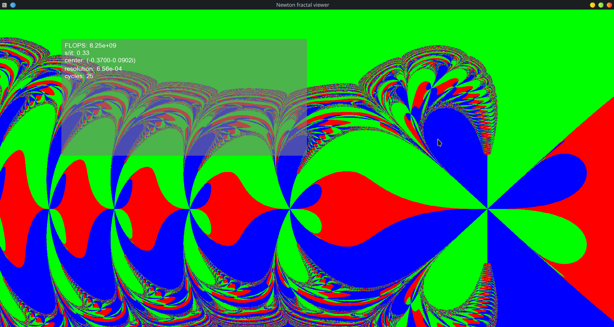

:title: Newton's fractals using SYCL
:author: zeFresk
:version-label: 1.0.0

= Newton fractals

This repository provides a SYCL implementation of the Newton's fractal with an SFML interface for convenience.

It relies on constant-time computations for polynomials and complex numbers and everything could theoretically be `constexpr` if not for SYCL.

.Screenshot of the application


== Features

* [*] Fully interactive.
* [*] custom colors allowed (pass them to `Interface`'s constructor).
* [*] custom polynomial (update `roots` array inside `main`).
* [*] CUDA, ROCM, OpenMP, intel GPU acceleration thanks to SYCL.
* [*] Almost fully `constexpr`
* [*] Portable

== Installation

You will need to install SYCL and SFML. Then you can simply use cmake to compile everything.

.Example using AdaptiveCpp (SYCL) and clang
****
IMPORTANT: Adapt this command to your acpp installation path! (replace `PATH_TO_ACPP_INSTALL` with yours)
```bash
mkdir build && cd build
CC=clang CXX=clang++ cmake .. -DAdaptiveCpp_DIR=PATH_TO_ACPP_INSTALL
cmake --build . -j8
```
****

== Running the application

IMPORTANT: Run the application from the root source directory, otherwise some resources may not be found.

Once compiled, you can run the application from the root directory using:

```bash
./build/newton
```

By default, the program will try to use a GPU and will fallback to CPU otherwise. You can force a backend (ex: CUDA) using ACPP in the following manner:

```bash
ACPP_VISIBILITY_MASK="cuda" ./build/newton
```

=== Commands inside the application

* 🠝🠟🠞🠜 | UP, DOWN, RIGHT, LEFT arrow keys: move the plane around.
* 🔍    |  +, = keys: zoom in
* 🔍    |  -, / keys: zoom out
* ↺ |   control and zoom in: increase number of iterations
 * ↺ |   control and zoom out: decrease number of iterations
* 🛈    |  i key: show/hide information window
